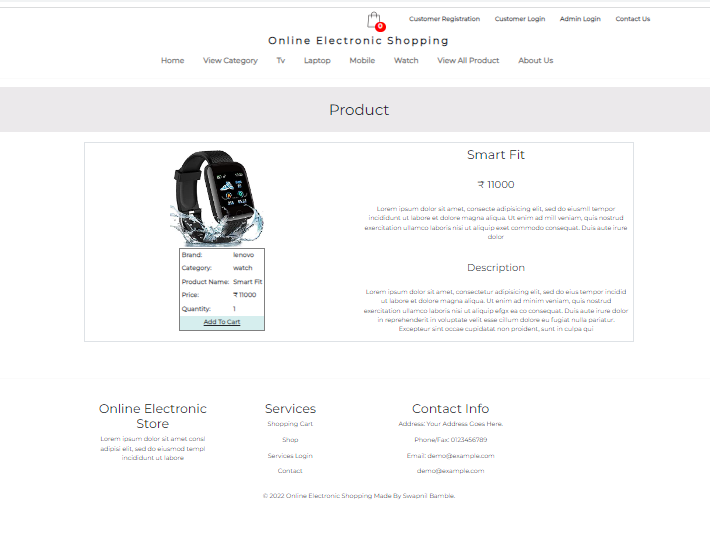
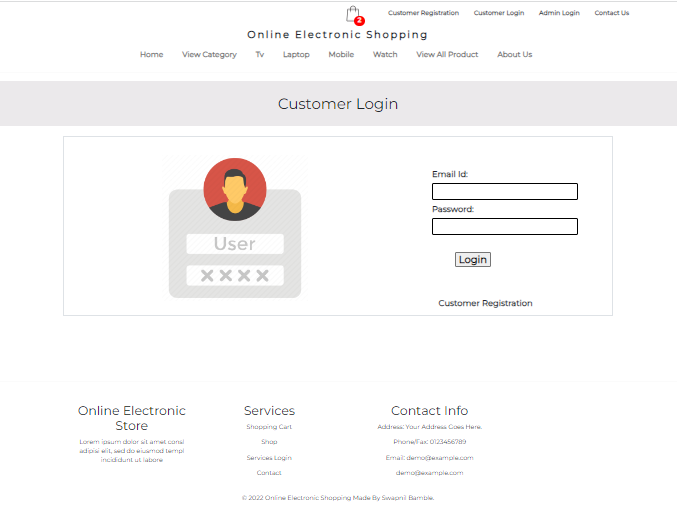
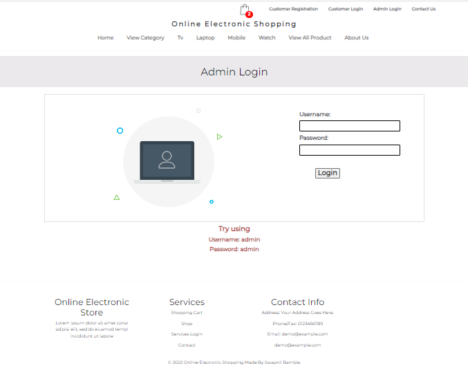

# Приложение для электронной коммерции - Java J2EE

### Взгляните на это приложение

### Это приложение Java J2EE. Выполните сборку в Eclipse IDE с помощью Maven.
## Это приложение для электронных покупок в Интернете.

### Особенности приложения
- В нем показан рабочий пример того, как работают веб-сайты интернет-магазинов.
-   Где Пользователь может добавить товар в корзину, Пользователь может зарегистрироваться, войти, выйти из системы или купить товар. а Администратор может добавлять новые Продукты в список товаров и может управлять Клиентами.

### Технологии, использованные в данном проекте:
- i) Java: вся логика бэкенда была написана на java.
- ii) HTML, CSS и Bootstrap: разработка макета страницы.
- iii) JSP и Javascript: вся логика фронтенда была написана на jsp и javascript. 
- iv) SQLite: База данных SQLite использовалась в качестве базы данных.
- v) Tomcat: проект будет запущен через сервер tomcat.
- vi) Maven: Maven используется для получения необходимых jar-файлов.

### Необходимое программное обеспечение и инструменты:
- Java JDK 8+
- Eclipse EE
- Apache Maven
- Tomcat v8.0+
- Инструменты SQLite (онлайн или офлайн инструменты)

### Некоторые скриншоты этого проекта:

==================================================================================================================================================================

==================================================================================================================================================================

==================================================================================================================================================================

==================================================================================================================================================================

==================================================================================================================================================================

==================================================================================================================================================================

==================================================================================================================================================================

==================================================================================================================================================================

==================================================================================================================================================================

==================================================================================================================================================================

